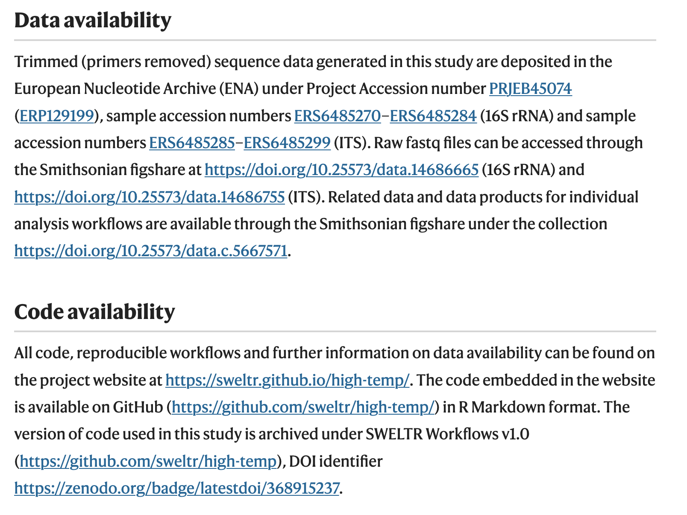
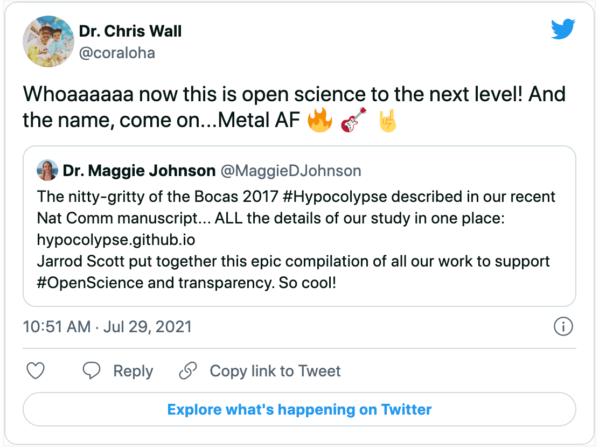
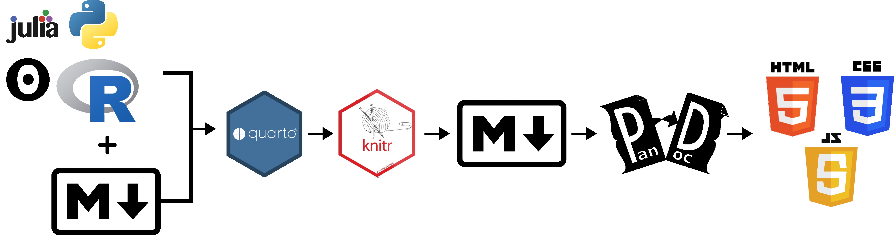
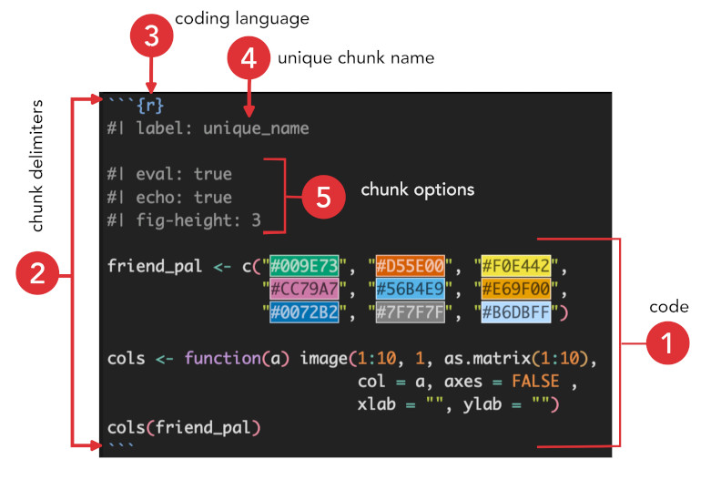

```{r}
#| eval: true
#| echo: false

pacman::p_load(tidyverse, fontawesome, scholar, rcrossref,
               webdriver, rvest,
               install = FALSE, update = FALSE)

```

# Open Scholarship

Rationale and Definition

## Motivation

`r fa(name = "quote-left", fill = "steelblue", height = "36px")` More than 70% of researchers have tried and failed to reproduce another scientist's experiments, and more than half have failed to reproduce their own experiments. Those are some of the telling figures that emerged from Nature's survey of 1,576 researchers who took a brief online questionnaire on reproducibility in research. `r fa(name = "quote-right", fill = "steelblue", height = "36px")` [@baker20161]^[As of today, this article has been cited at least **`r cr_citation_count(doi = "10.1038/533452a")$count`** times. To get the number of citations for this article I used the function `cr_citation_count` from the [`rcrossref`](https://cran.r-project.org/web/packages/rcrossref/index.html) package. The function takes a Digital Object Identifier (DOI) as the input and searches CrossRef OpenURL to return the number of citations.]

## Some definitions {.smaller}

According to this article in Science Translational Medicine, reproducibility …

 > `r fa(name = "quote-left", fill = "steelblue", height = "36px")` … [is a] set of procedures that permit the reader of a paper to see the entire processing trail from the raw data and code to figures and tables. `r fa(name = "quote-right", fill = "steelblue", height = "36px")` [@goodman2016does]

Or the U.S. National Science Foundation (NSF) defines it this way …

> `r fa(name = "quote-left", fill = "steelblue", height = "36px")`  … refers to the ability of a researcher to duplicate the results of a prior study using the same materials as were used by the original investigator. `r fa(name = "quote-right", fill = "steelblue", height = "36px")` [@cacioppo2015social]

## Main principles

```{r}
#| fig-align: center


```

# Examples

## Publication Workflows {.smaller}

Publication: [*Microbial diversity declines in warmed tropical soil and respiration rise exceed predictions as communities adapt*](https://www.nature.com/articles/s41564-022-01200-1){preview-link="false"}

Workflow: [SWELTR](https://sweltr.github.io/high-temp/) created in the [Quarto](https://quarto.org/) framework.

<hr>

Publication: [*Rapid ecosystem-scale consequences of acute deoxygenation on a Caribbean reef.*](https://www.nature.com/articles/s41467-021-24777-3){preview-link="false"}

Workflow: [Hypocolypse](https://hypocolypse.github.io/) created using [Distll](https://rstudio.github.io/distill/). 

<hr>

Publication: [*Intestinal microbes as an axis of functional diversity among large marine consumers.*](https://royalsocietypublishing.org/doi/10.1098/rspb.2019.2367){preview-link="false"}

Workflow: [ProjectDIGEST](https://projectdigest.github.io/) created using native R Markdown.

::: footer
All source code hosted on GitHub and freely available.
:::

##

```{r}
#| fig-align: center


```

## 

```{r}
#| fig-align: center


```


## Other R Markdown examples {.smaller}

[The Istmobiome Project](https://istmobiome.rbind.io/) Project site created with [blogdown](https://bookdown.org/yihui/blogdown/){preview-link="false"} and [Hugo](https://gohugo.io/){preview-link="false"}. 

<hr>

[Cacao Fermentation](https://istmobiome.github.io/cacao/talk.html#/) Presentation created using  [reveal.js](https://github.com/hakimel/reveal.js){preview-link="false"}. 

<hr>

[How the Isthmus of Panama changed the world](https://istmobiome.github.io/the-isthmus/the-isthmus.html) Presentation created with the [xaringan](https://github.com/yihui/xaringan){preview-link="false"} package.

<hr>

[R Markdown Fieldguide](https://stri-mcgill-neo.github.io/2022/) R Markdown tutorial website for the 2022 STRI-McGill NEO field course. Made with the [Distill](https://rstudio.github.io/distill/){preview-link="false"} blog template.

<hr>

[Interactive fish phylogeny](https://istmobiome.rbind.io/project/betancur-r-fish-tree/) Workflow on database scraping and visualization. 

<hr>

My [CV](https://istmobiome.github.io/jarrod/jarrod-cv.html) created using [pagedown](https://github.com/rstudio/pagedown){preview-link="false"}.

::: footer
All source code hosted on GitHub and freely available.
:::


# [Quarto](https://quarto.org/)

An open-source scientific and technical publishing system

## Rendering Process {.smaller}

```{r}
#| fig-align: center


```

1. Quarto document (`.qmd`) contains code and Markdown formatted text. 
2. [`knitr`](https://yihui.org/knitr/) executes all the R code, knits the results together with Markdown text, and creates a new Markdown document. 
3. The new Markdown document is then processed by [PanDoc](https://pandoc.org/){preview-link="false"}, which converts the Markdown syntax into HTML and CSS code. PanDoc is like a swiss-army knife for Markdown—it can covert many types of Markdown documents into a variety of other formats. All of these steps happen behind the scenes. As long as you have a properly formatted R Markdown document, these tools will take care of the rest.

# Markdown

## Defined

[Markdown](https://www.markdownguide.org/){preview-link="false"} is a "*lightweight markup language with plain-text-formatting syntax.*" 

What this means is that Markdown is easy-to-write using any generic text editor and easy-to-read in its raw form.

## Markdown Resources {.smaller}

Here are a few resources I recommend to augment your skill development.

* [Basic Markdown Syntax Reference](https://www.markdownguide.org/basic-syntax/){preview-link="false"} from *[The Markdown Guide](https://www.markdownguide.org/){preview-link="false"}*, a free and open-source reference guide.
* [Extended Markdown Syntax Reference](https://www.markdownguide.org/extended-syntax/){preview-link="false"}. Advanced features that build on the basic Markdown syntax. Also from *[The Markdown Guide](https://www.markdownguide.org/){preview-link="false"}*.
* [Interactive Markdown Tutorial](https://commonmark.org/help/tutorial/index.html){preview-link="false"} for beginners. Each lesson contains an  explanation of Markdown syntax. Hit the ***Try it*** button to test your skills and see what your solution looks like when it is rendered. There is also an option to see the HTML equivalent of the Markdown text. This is a nice tutorial.
* [Markdown Tables Generator](https://www.tablesgenerator.com/markdown_tables){preview-link="false"}. Tired of typing all of those hyphens and pipes?
* [Character Entity Reference Chart](https://dev.w3.org/html5/html-author/charref){preview-link="false"} for coding special symblos in Markdown.
* [Hacks](https://www.markdownguide.org/hacks/#link-targets){preview-link="false"}. Workarounds for things not officially supported by Markdown.

## Markdown Editors  {.smaller .scrollable}

Markdown editors are a great tool to learn Markdown because you can see a **live preview** of what the rendered text will look like. 

### Markdown Online Editors

Online editors are universally supported across operating systems. Here are a few to get you started. 

* [StackEdit](https://stackedit.io/){preview-link="false"}. In-browser Markdown editor
* [Dillinger](https://dillinger.io/){preview-link="false"}. "The Last Markdown Editor, Ever."
* [MarkTwo](https://marktwo.app/){preview-link="false"}. Free, open source progressive web app. 

### Markdown Desktop Editors

I only listing free desktop editors here. There are plenty more if you are willing to pony up some cash. Some of these are operating system specific while others are universal. 

* [MarkText](https://github.com/marktext/marktext){preview-link="false"} is a simple and elegant open-source markdown editor that focused on speed and usability.. **Universal**.
* [Zettlr](https://www.zettlr.com/){preview-link="false"}  ships with a lot of features helpful in writing markdown. It is especially aimed at writing research papers in the arts and humanities (and therefore offers writing aids such as automatic footnote insertion and in-place editing, or a global search). **Universal**.
* [Znote](https://znote.io/){preview-link="false"} is a free, elegant program meant to help you write beautifully organized Markdown documents. You can organize your texts, notes, and files even better, using the simplistic left-side widget organizer for smoothly navigating different files. **Universal**.
* [MarkdownPad](http://markdownpad.com/){preview-link="false"} and [MarkdownPad 2](http://markdownpad.com/news/2013/introducing-markdownpad-2/){preview-link="false"} are full-featured Markdown editors for **Windows**.
* [MacDown](https://macdown.uranusjr.com/){preview-link="false"} is an open source Markdown editor for **macOS**.

# Live Code a Website

# Adding Code

## Code chunk anatomy

```{r}
#| fig-align: center


```

# Naming Things

## 

> Goal is to ensure your files are Machine and Human readable.

This applies to:

- files
- directories
- variables in code
- tabular data (row and column names)

## Do not use spaces to separate words {.scrollable}

**Kebab case**: Words delimited by a hyphen (`-`)^[cannot be used for R variable].

```
file-one
directory-two
```

**Snake case**: Words delimited by an underscore (`_`).

```
file_one
variable_two
```

**Pascal case**: Words delimited by capital letters.

```
FileOne
VariableTwo
```

**Camel case**: Words delimited by capital letters, except the initial word.

```
fileOne
variableTwo
```

## Special characters

**Never** use *special characters* in your  naming scheme. 

(e.g., `* # : \ / < > | " ? [ ] ; , = + & £ $` , and so on). 

Many symbols are prohibited and a lot of software will reject these symbols.

Letters, numbers, dashes, underscores only. 

## [MathJax](https://www.mathjax.org/){preview-link="false"} render equations to HTML

::: {.panel-tabset}

### Code

```{verbatim}

$$
\begin{cases}
\dot{x}  = \sigma(y-x)  \\
\dot{y} = \rho x - y - xz  \\
\dot{z} = -\beta z + xy
\end{cases}
$$

\begin{gather*}
e^{i\pi} + 1 = 0
\end{gather*}

\begin{align}
f(k) = {n \choose k} p^{k} (1-p)^{n-k}
\end{align}
```

### Output

$$
\begin{cases}
\dot{x}  = \sigma(y-x)  \\
\dot{y} = \rho x - y - xz  \\
\dot{z} = -\beta z + xy
\end{cases}
$$
\begin{gather*}
e^{i\pi} + 1 = 0
\end{gather*}

\begin{align}
f(k) = {n \choose k} p^{k} (1-p)^{n-k}
\end{align}

:::

## {.references}